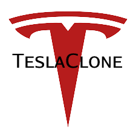

<h1 align="center">
    
</h1>

</br>
<p align="center">
  <a href="#preview">Preview</a>&nbsp;&nbsp;&nbsp;|&nbsp;&nbsp;&nbsp;
  <a href="#technologies">Technologies</a>&nbsp;&nbsp;&nbsp;|&nbsp;&nbsp;&nbsp;
  <a href="#project">Project</a>&nbsp;&nbsp;&nbsp;|&nbsp;&nbsp;&nbsp;
  <a href="#Getting started">Getting started</a>&nbsp;&nbsp;&nbsp;|&nbsp;&nbsp;&nbsp;
  <a href="#license">License</a>
</p></br>

<p align="center">
  
  
       

  
</p>

</br>


---  
</br>
<h4 align="center"> 
	<b>🚧  TeslaClone</b> 🚀 it's under construction...  🚧
</h4> </br>
  
# 📱 Preview  

<p>This is the preview of the app running in my phone,so allons-y :</p> </br>  


# 🤖 Technologies 

<p align="center">This project was developed using the following technologies:</p> </br>
<p align="center"><a href="https://reactnative.dev/"></a> <a href="https://expo.io/"></a></p></br>
  
# 💻 Project
  
his application was developed in order to learn concepts about react native, the study reference was the video by [Vadim Savin](https://github.com/Savinvadim1312) and the Tesla website.

# 🚀 Getting started

Clone the project and access the folder

```bash
$ git clone https://github.com/CrysLef/teslaClone && cd teslaClone
```

Follow the steps below
```bash
# Install the dependencies

$ yarn install

# Start the project

$ expo start
```

<p>If you have any problems or questions about that, go to this <a href='https://react-native.rocketseat.dev/'>link</a> for more information how to configurate your workspace and follow the steps.</p></br>
  

# 📝 License

This project is licensed under the MIT License. See the [LICENSE](https://github.com/CrysLef/teslaClone/blob/main/LICENSE) file for details.


---

Made by [Crystian](https://www.linkedin.com/in/crystian-lefundes/) ❤️ !